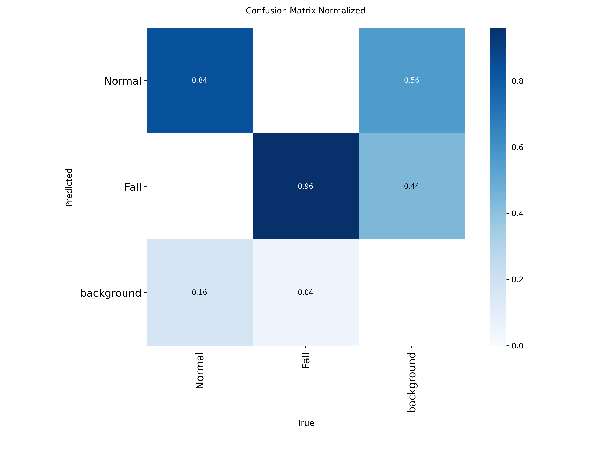
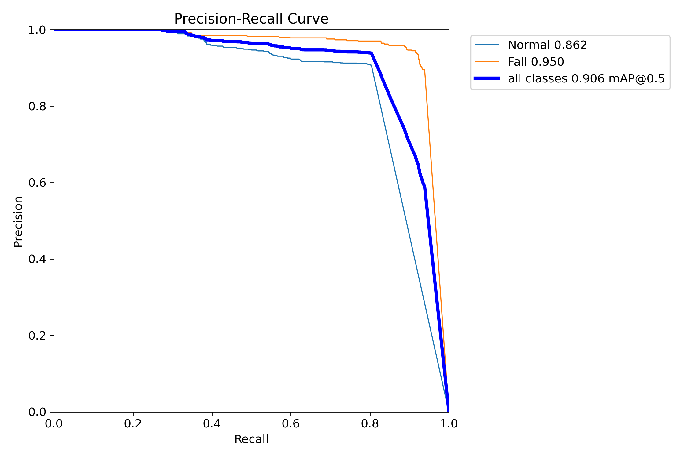
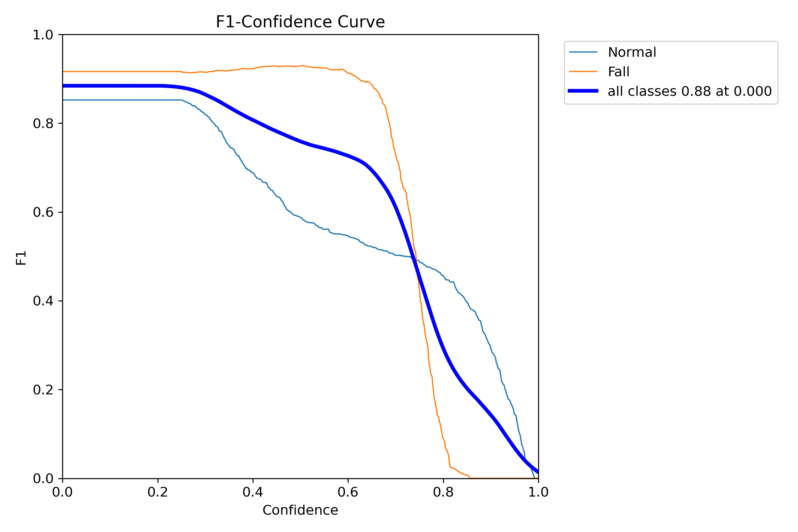
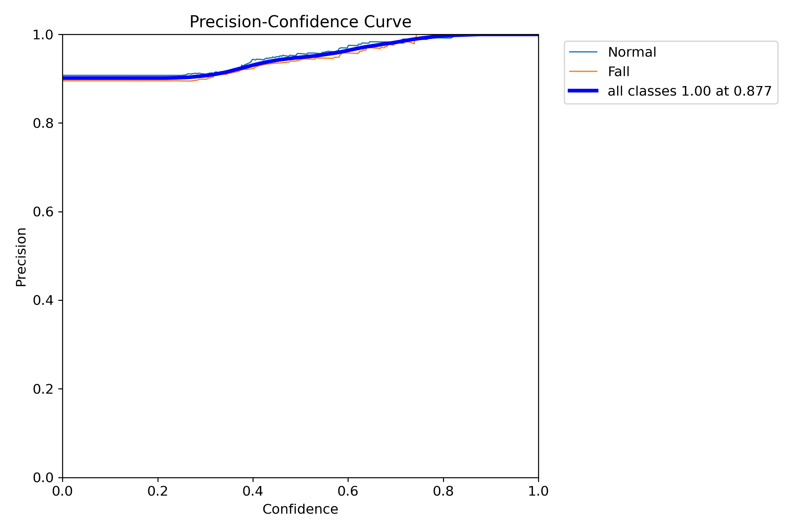
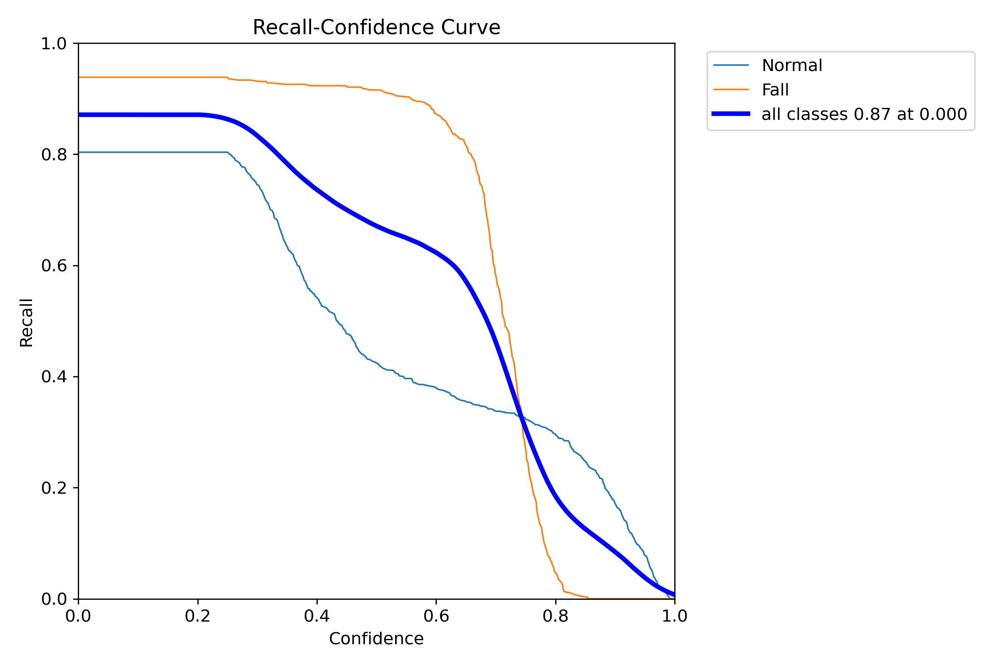
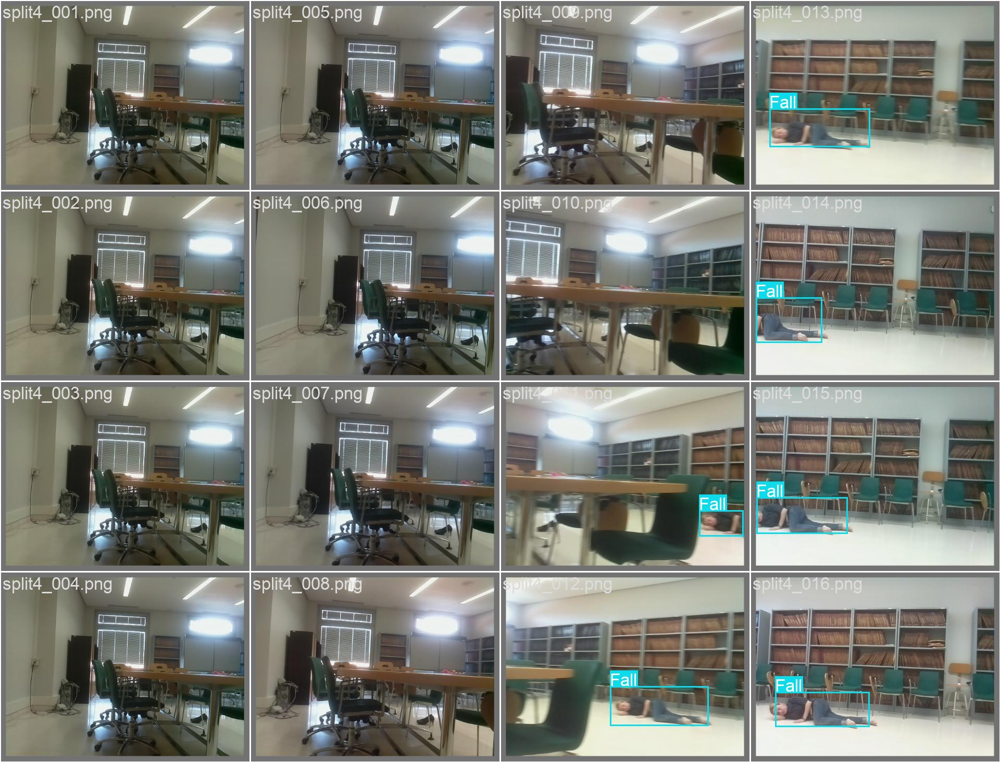

# 🚨 人体摔倒检测系统 (Human Fall Detection)

<div align="center">

[English](README.md) | [简体中文](README_CN.md)

</div>

[](https://github.com/ultralytics/ultralytics)
[](https://pytorch.org/)
[](https://www.python.org/)

基于YOLOv8的静态图像摔倒检测系统，支持实时视频流和离线视频文件处理。

## 📋 目录

- [🚨 人体摔倒检测系统 (Human Fall Detection)](#-人体摔倒检测系统-human-fall-detection)
  - [📋 目录](#-目录)
  - [🎯 项目简介](#-项目简介)
  - [📊 模型性能](#-模型性能)
    - [分类别性能](#分类别性能)
      - [🟢 正常状态 (Normal)](#-正常状态-normal)
      - [🔴 摔倒状态 (Fall)](#-摔倒状态-fall)
  - [💾 安装方法](#-安装方法)
    - [方法一：pip安装（推荐）](#方法一pip安装推荐)
    - [方法二：从源码安装](#方法二从源码安装)
  - [📖 使用示例](#-使用示例)
    - [Jupyter Notebook 示例](#jupyter-notebook-示例)
  - [📈 评估结果](#-评估结果)
    - [性能指标图表](#性能指标图表)
    - [检测示例](#检测示例)
    - [视频检测效果](#视频检测效果)
  - [🙏 致谢](#-致谢)
  - [📮 联系方式](#-联系方式)

## 🎯 项目简介

本项目是一个基于深度学习的人体摔倒检测系统，使用微调的YOLOv8模型实现高精度的摔倒检测。该系统可以应用于老年人看护、医院监控、智能家居等场景，及时发现摔倒事件并发出警报。

## 📊 模型性能

基于测试集（973张图像）的评估结果：

| 指标             | 数值   | 说明                     |
| ---------------- | ------ | ------------------------ |
| **mAP@0.5**      | 94.85% | 主要性能指标             |
| **mAP@0.5:0.95** | 45.50% | 更严格的评估标准         |
| **F1-Score**     | 92.02% | 精确度和召回率的调和平均 |
| **总体精确度**   | 92.46% | 所有检测的准确率         |
| **总体召回率**   | 91.58% | 检测到的真实目标比例     |

### 分类别性能

#### 🟢 正常状态 (Normal)
- AP@0.5: 94.46%
- 精确度: 91.70%
- 召回率: 91.89%

#### 🔴 摔倒状态 (Fall)
- AP@0.5: 95.23%
- 精确度: 93.21%
- 召回率: 91.26%


## 💾 安装方法

### 方法一：pip安装（推荐）

```bash
pip install human-fall-detection
```

### 方法二：从源码安装

```bash
git clone https://github.com/TomokotoKiyoshi/Human-Fall-Detection.git
cd Human-Fall-Detection
uv sync
```

## 📖 使用示例

### Jupyter Notebook 示例

参见 `example_usage.ipynb` 获取交互式示例。

## 📈 评估结果

### 性能指标图表

|                                    混淆矩阵                                     |                              PR曲线                              |                            F1曲线                             |
| :-----------------------------------------------------------------------------: | :--------------------------------------------------------------: | :-----------------------------------------------------------: |
|  |     |  |
|                                 **精确度曲线**                                  |                          **召回率曲线**                          |                                                               |
|                 |  |                                                               |

### 检测示例

以下是模型在测试集上的实际检测效果：

| 原始标注                                                          | 模型预测                                                        |
| ----------------------------------------------------------------- | --------------------------------------------------------------- |
|  |  |

### 视频检测效果

以下是系统处理视频的实际效果展示：

<div align="center">


</div>

视频展示了系统的实时检测能力：
- 🟩 绿色框：正常状态
- 🟥 红色框：检测到摔倒
- 实时显示置信度分数


## 🙏 致谢

- [Ultralytics YOLOv8](https://github.com/ultralytics/ultralytics) - 提供优秀的目标检测框架
- [UAH Fall Detection Dataset](https://gram.web.uah.es/data/datasets/fpds/index.html) - 提供高质量的摔倒检测数据集

## 📮 联系方式

- 项目主页: [https://github.com/TomokotoKiyoshi/Human-Fall-Detection](https://github.com/TomokotoKiyoshi/Human-Fall-Detection)
- 问题反馈: [Issues](https://github.com/TomokotoKiyoshi/Human-Fall-Detection/issues)

---

<div align="center">

**⭐ 如果这个项目对您有帮助，请给个星标支持！**

</div>